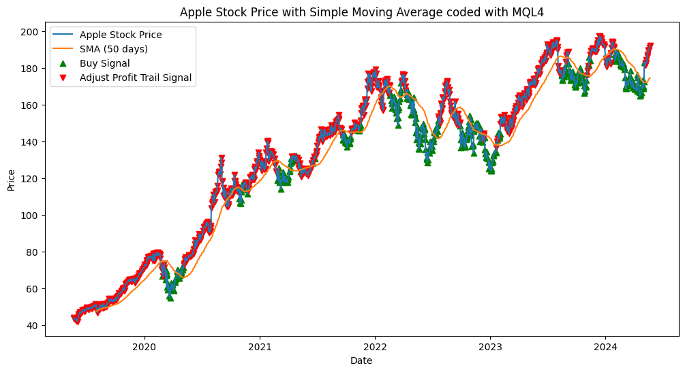

# MetaTrader 4 Internship Assignment

This repository contains the code and documentation for my completion of the MetaTrader 4 (MT4) internship assignment.

## Assignment Completion Summary

I successfully completed the internship assignment by following these steps:

1. **Installation of MetaTrader 4 (MT4):**
   I downloaded and installed MetaTrader 4 from the official MetaQuotes website.

2. **Setting up a Sample Account in MT4:**
   After installing MT4, I created a demo account within the platform to practice trading with virtual money.

3. **Executing Trades Using MQL4:**
   I utilized the MQL4 programming language to write scripts and Expert Advisors (EAs) within MetaTrader 4.

4. **Developing Code to Trail Take Profit Based on the SMA Indicator:**
   I developed MQL4 code to implement a trailing take profit strategy based on the Simple Moving Average (SMA) indicator.

5. **Implementing Logic:**
   I integrated logic into my MQL4 code to adjust the take profit trailing mechanism based on the slope of the SMA indicator.

## Image of Graph showing where to buy and where to adjust profit trails using SMA indicator

